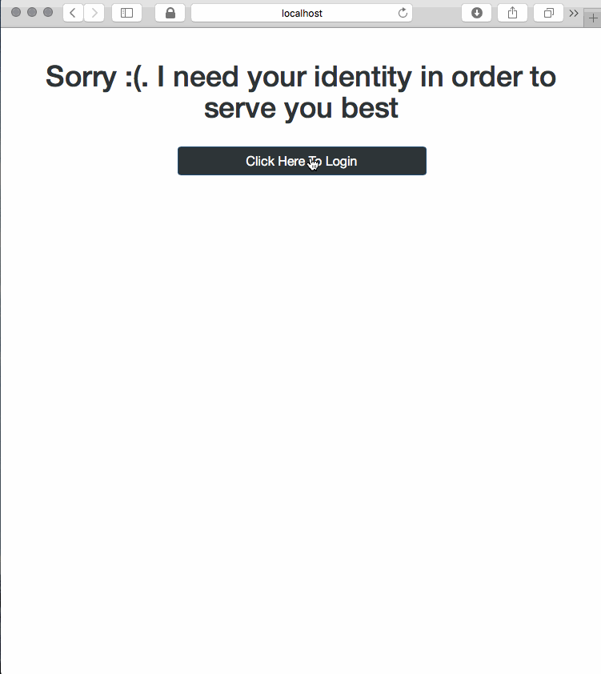
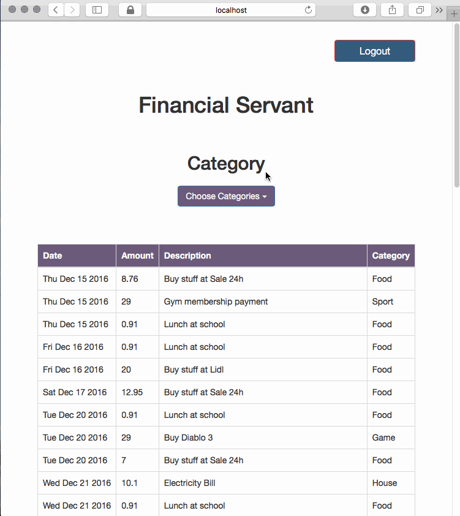
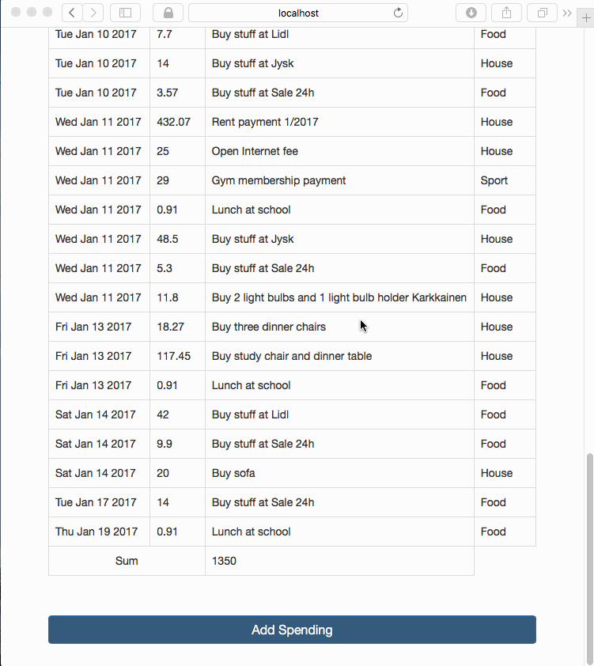
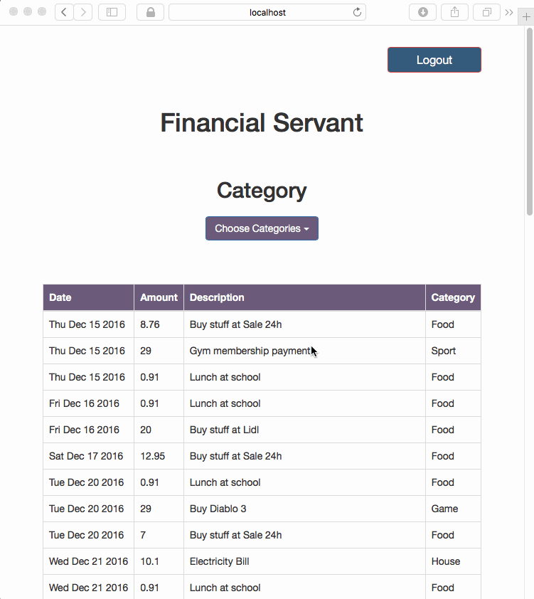

# Financial_Servant

This project is my personal project. The motivation for this project is that I need an application that can help me to control my spending.

This project is currently in development. New features will be added in the near future.

Because I am the only one who use this application so my data will be store in .json file. In addition, my application also has a login feature in order to scale it to multiple users in the future.

## Getting Started

### Technologies
- Bootstrap and normal CSS for UI
- Express for Back-End
- JSON for saving data

### Installing
Clone the project
```
git clone https://github.com/JoeNguyen93/Financial_Servant.git
```

Install package dependencies
```
npm install
```

## Demo
### Login 


### Change Category


### Add New Spending


### Logout

